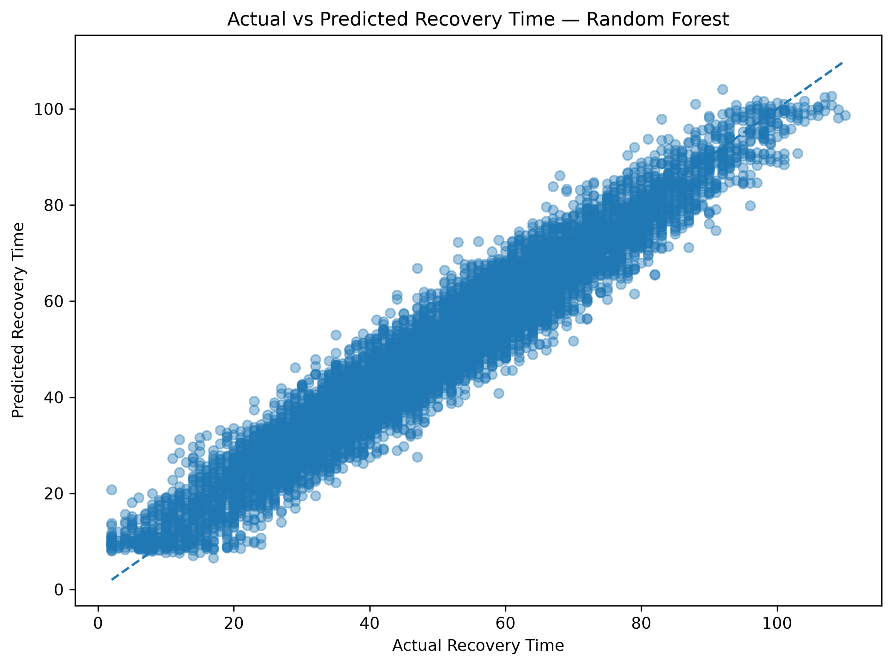
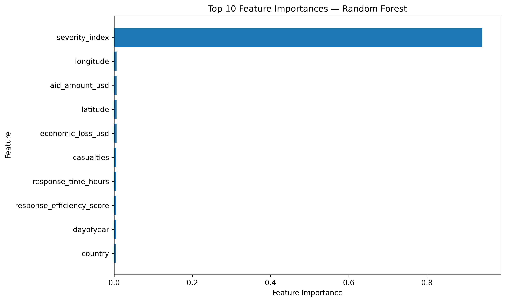

# Disaster Recovery Time Prediction Using Machine Learning

This project uses machine learning to predict **recovery time (in days)** following global disaster events between 2018 and 2024.

Using information such as disaster severity, casualties, economic losses, response times and aid provided, the project explores which factors are associated with recovery time and trains regression models to predict `recovery_days`.

---

## Project Goal

Given information about a disaster event, predict:

> **How many days will recovery take?**

Accurate recovery-time estimates could help governments, NGOs and relief organizations with resource planning and provide insight into the factors associated with longer recovery periods.

---

## Dataset

The dataset contains **50,000 records** with features including:

- `country`
- `disaster_type`
- `severity_index`
- `casualties`
- `economic_loss_usd`
- `response_time_hours`
- `aid_amount_usd`
- `response_efficiency_score`
- `recovery_days`
- `latitude`
- `longitude`

Additional features were derived from the event date:

- `year`
- `month`
- `dayofyear`

---

## Approach

### 1. Data Preprocessing

The preprocessing pipeline:

- Converted `date` into:
  - `year`
  - `month`
  - `dayofyear`
- Removed the original string `date` column
- Label-encoded:
  - `country`
  - `disaster_type`
- Split the dataset into:
  - **80% training data**
  - **20% test data**

### 2. Models

Two regression approaches were explored:

- **Linear Regression** — used as a baseline
- **Random Forest Regressor** — used as the main model

### 3. Evaluation

Model performance was evaluated using:

- **MSE** — Mean Squared Error
- **RMSE** — Root Mean Squared Error
- **MAE** — Mean Absolute Error
- **R²** — Coefficient of Determination

---

## Model Results

The Random Forest model produced:

| Metric | Score |
|---|---:|
| RMSE | 5.10 |
| MAE | 4.07 |
| R² | 0.936 |

An R² of approximately **0.936** means that the model explains a large proportion of the variation in recovery time within the test data. However, model performance alone does not establish that every feature is equally meaningful, so I also inspected the model's predictions and feature importance.

---

## Actual vs Predicted Recovery Time

The model's predicted recovery times were compared against the actual values from the test set.



This visualization provides a more direct view of model behaviour than the evaluation metrics alone. Predictions closer to the diagonal reference line represent smaller prediction errors.

---

## Feature Importance

Random Forest feature importance was used to examine which variables contributed most strongly to the model's predictions.



One result stood out immediately: **`severity_index` accounts for the majority of the model's feature importance**.

Rather than treating the high R² alone as evidence that the modelling problem is solved, this raises an important question about why `severity_index` is so dominant. A useful next step would be to investigate how that feature is constructed and test whether its predictive strength represents a genuine relationship with recovery time or whether it makes the prediction task unusually easy.

---

## Exploratory Data Analysis

The notebook also explores:

- Top 10 countries by number of disasters
- Distribution of disaster types
- Correlations between numerical features
- Severity vs. recovery days
- Response time vs. recovery days
- Recovery days by disaster type
- Random Forest feature importance

The EDA was used to understand the dataset before interpreting the model's results rather than relying only on final performance metrics.

---

## Key Observations

The analysis suggests that disaster severity has a particularly strong relationship with predicted recovery time.

Other variables explored include:

- economic loss
- response time
- casualties
- aid amount
- response efficiency
- disaster type
- geographical features

The strong dominance of `severity_index` in the Random Forest is also a limitation worth investigating further rather than assuming that all of the model's predictive performance will generalize equally well to new disaster data.

---

## Tech Stack

- Python
- pandas
- NumPy
- scikit-learn
- Matplotlib
- Seaborn
- Jupyter Notebook

---

## Project Structure

```text
Disaster-Recovery-Time-Prediction-using-Machine-Learning/
│
├── README.md
│
└── disaster_recovery_ml/
    ├── data/
    │   └── global_disaster_response_2018_2024 (1).csv
    │
    ├── images/
    │   ├── actual_vs_predicted.png
    │   └── feature_importance.png
    │
    ├── notebook/
    │   └── recovery_time_prediction.ipynb
    │
    └── requirements.txt
```

---

## How to Run

Clone the repository:

```bash
git clone https://github.com/haz4rl/Disaster-Recovery-Time-Prediction-using-Machine-Learning.git
cd Disaster-Recovery-Time-Prediction-using-Machine-Learning
```

Install the required dependencies:

```bash
pip install -r disaster_recovery_ml/requirements.txt
```

Open:

```text
disaster_recovery_ml/notebook/recovery_time_prediction.ipynb
```

Select a Python environment and run the notebook cells in order.

The notebook uses a relative path to load the dataset, so it can be run after cloning the repository without changing the path to match a specific local machine.

---

## What I Learned

This project gave me practical experience with the full workflow of a small machine-learning experiment: exploring data, preprocessing features, establishing a baseline, training a more flexible model and evaluating its behaviour on held-out data.

One of the more useful lessons came after training rather than during training. The Random Forest achieved a strong R², but inspecting its feature importance showed that one variable, `severity_index`, was responsible for most of its predictive power. That reinforced the importance of looking beyond a headline metric and asking **why** a model performs well.

If I extended the project, I would investigate that feature more closely, test the model without it, use cross-validation, and compare additional modelling approaches to better understand how robust the performance is.